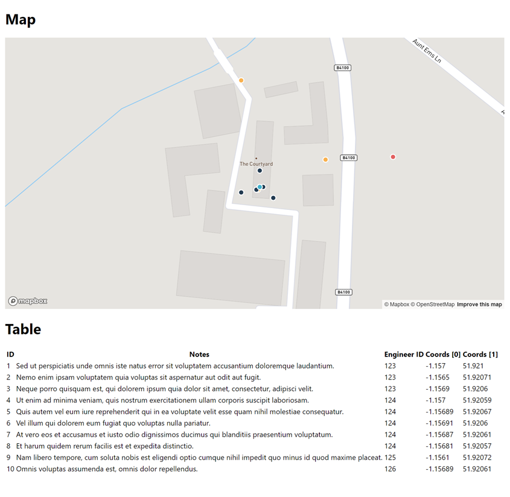

# Technical Test Skeleton Repo

This project was bootstrapped with [Create React App](https://github.com/facebook/create-react-app).

Install dependencies with `yarn install`.

Start the app with `yarn start`.

# Task to complete

You will find some JSON data in the src directory called `data.json`.

1. Your first task is to add the data to a layer on the mapbox map. Please refer to the mapbox docs for information how to tackle this [https://docs.mapbox.com/help/getting-started/](https://docs.mapbox.com/help/getting-started/). The aim is to plot it with the following requirements:

   - Plot the points on the map with the correct coordinates (they should be placed over the Bicester FIDO Tech office).
   - (Optional) Using data-driven properties, plot the points clearly with different colours based on the engineer ID field.

2. Next, plot the same data into the table below the map, specifically:

   - ID
   - Notes
   - Engineer ID
   - Coords [0]
   - Coords [1]

3. Add some basic tests that checks the table has rendered correctly. You don't unit test everything, just basic use cases. Do not make tests for the Mapbox API. We recommend using the [react testing library](https://github.com/testing-library/react-testing-library).

4. Once the above has been completed, please commit your code into a public repository and send the link to [Rob](rsanins@fido.tech) prior to the techinical interview so we can have a look before hand.

# Notes and Tips

- Do not worry about styling and making it look pretty.
- We are looking for:
  - A good understanding of React and Typescript
  - Ability to pick up a new API
  - Ability to write tests
  - A sensible good commit history
  - Good code structure and best practices
- Please do not go beyond the brief, we appreciate your time and believe this should be enough of an insight into your abilities!
- Remember that setting up the react app in dev mode may be slightly different to the production mode. To check how this runs in production, run `yarn build` then follow the suggestions [here](https://create-react-app.dev/docs/deployment/#static-server).

Best of luck!
